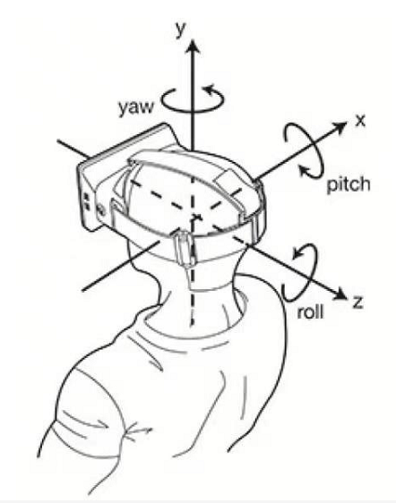

## 硬件要求
最低配置：Intel® CoreTM i5-2300@2.80GHz 或者同级别芯片<br/>
推荐配置：Intel® CoreTM i7-4600U@2.1GHz 或者同级别芯片<br/>

#  健康检测
`GET http://127.0.0.1/healthcheck`
返回
```
Healthy
```
#  两张图片人脸对比

`POST http://127.0.0.1/CheckPic2`
或
`POST http://127.0.0.1`
`Content-Type: application/json`

```json
{
    "pic1":"Base64String",
    "pic2":"Base64String",
}
```
## 响应
```json
{
  "message":"错误信息",
  "success":true,
  "code":0
  "data":0.8
}
```
#  扣脸/照片矫正
只返回扣脸照片
`POST http://127.0.0.1`
`Content-Type: application/json`

```json
{
    "pic1":"Base64String"
}
```
或 直接文件流 `Content-Type.StartsWith( "multipart/form-data")  Content-Length = 文件大小 Body是文件流`
## 响应
```json
{
  "message":"错误信息",
  "success":true,
  "data":"照片base64string"
}
```
#  扣脸/照片矫正2
返回照片信息（包括遮挡信息）
```
POST http://127.0.0.1/CheckPic2
```
`Content-Type: application/json`

```json
{
    "pic1":"Base64String"
}
```
或 直接文件流 `Content-Type.StartsWith( "multipart/form-data")  Content-Length = 文件大小 Body是文件流`


#  证件照扣脸/照片矫正3
返回照片信息（包括遮挡信息）
不校验照片质量 活体 大小
```
POST http://127.0.0.1/CheckIdPic
```
`Content-Type: application/json`

```json
{
    "pic1":"Base64String"
}
```
或 直接文件流 `Content-Type.StartsWith( "multipart/form-data")  Content-Length = 文件大小 Body是文件流`

## 响应
```json

{
  "message": "矫正成功",
  "success": true,
  "data": {
      "x": 197,
      "y": 148,
      "width": 252,
      "height": 252,    /* 原始照片头像坐标大小*/
      "imageQuality": 0.503950834, /*图像质量 -1无效  (0.0~1.0) */
      "snapBuffer": "照片base64string",
      "faceInfo": {
        "orient": 0,   /* 原始照片头像角度 */
        "sex": 1,      /* 0:男  1:女*/
        "age": 21,
        "_3DAngle": {  /* 偏航角*/
          "state": 0,  /* 是否检测成功，0成功，其他为失败*/
          "roll": 2.14,
          "yaw": -3.26,
          "pitch": -10.41
        },
        "rgbLive": -2, /* 0：非真人；1：真人；-1：不确定；-2:传入人脸数>1；-3: 人脸过小 -4: 角度过大 -5: 人脸超出边界 */
        "mask": 0, /* 口罩 "0" 代表没有带口罩，"1"代表带口罩 ,"-1"表不确定 */
        "wearGlasses":0.5, /* 戴眼镜置信度[0-1],推荐阈值0.5 */
        "isLeftEyeClosed": false,  /* null:无效 true:闭眼  false:睁眼*/
        "isRightEyeClosed": false,  /* null:无效 true:闭眼  false:睁眼*/
        "faceShelter": 0, /* 面罩 "1" 表示 遮挡, "0" 表示 未遮挡, "-1" 表示不确定 */
        "faceLandPoint": { /*额头坐标*/
          "IsEmpty": true,   /* IsEmpty true 表示不确定*/
          "X": 0.0,
          "Y": 0.0
        }
      }
    }
}
```




# 当前配置信息
```json
{
    // 监听路径
    "Urls": "http://0.0.0.0:8200;http://0.0.0.0",
    "System": {
        // 是否对照片进行校验
        "IsReal": true,
        "IsBase64Log": false,
        // 测试时使用 是否缓存照片文件
        "IsSaveImg": true,
        // 启用目录浏览
        "UseDirectoryBrowser": true,
        "ImgUrlBase": null,
        "ReplaceUrlFrom": null,
        "ReplaceUrlTo": null
    },
    "ArcSoft": {
        "APPID": "xxxxxx",
        "KEY64": "xxxxxx",
        "KEY32": null,
        "KEYSo64": null,
        "ProActiveKey32": null,
        "ProActiveKey64": null,
        "ProActiveKeySo64": null,
        // 引擎个数
        "EngineNum": 2,
        "Similarity": 0.8,
        // 获取最相似的人脸
        // 否则获取到第一个相似度匹配的结果就结束对比
        "GetMostSimilar": true,
        // 是否是人证对比模式(登记照是证件照)
        "IsIdcardCompare": true,
        // 输入照片是否肯定是正脸
        "IsAngleZeroOnly": false,
        "CheckPic": {
            // 是否需要扣脸
            "NeedDetectFace": true,
            // 是否需要RGB活体检测
            "NeedRgbLive": true,
            // 是否需要带口罩
            "NeedMask": false,
            // 照片质量 (0.0~1.0) (-1表示不检测) (仅永久授权有效) 默认-1
            "ImageQuality": 0.7,
            // 最大人脸角度 默认30° 大于该角度的不进行对比 
            // 取值范围 0.0~180.0 建议30 
            // 小于等于0表示不比较
            "FaceMaxAngle": 30
        }
    },
    "CutPic": {
        // 是否要截图
        "Need": true,
        // 照片最大宽度 大于这个宽度会自动缩小
        "MaxWidth": 800,
        // 最小可用宽度 (建议为最小瞳距的3~4倍) 小于这个宽度会返回错误信息 默认240
        "MinWidth": 30,
        // 外扩比例(分母) 整数
        "OutwardScale": 2,
        // 最小外扩像素
        "MinOutwardPix": 15,
        //  裁剪照片 高度比
        "ScaleHeight": 1.0,
        //  裁剪照片 宽度比
        "ScaleWidth": 0.8,
        "NewBg": {
            // 是否需要将图片填充至1:1
            "Need": false,
            "R": 155,
            "G": 155,
            "B": 155,
            "A": 255
        }
    }
}
```